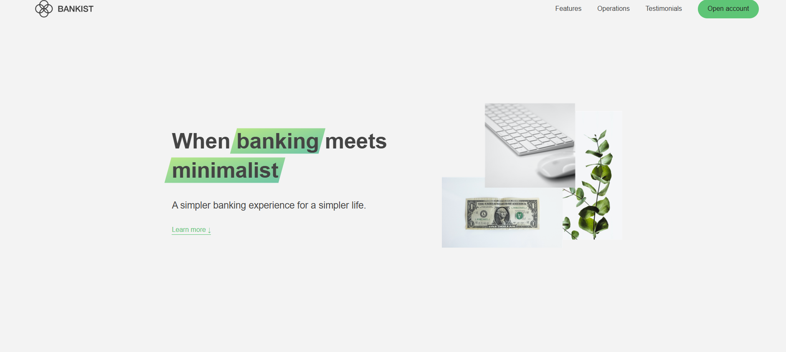

## 📸 Preview



# Bankist Website

Bankist is a **modern banking website** built with HTML, CSS, and JavaScript.  
It is a front-end project showcasing smooth animations, responsive design, and interactive UI components for a fictional digital bank.

---

## 🚀 Features

- Fully responsive design for all devices
- Smooth scrolling and navigation
- Sticky navigation bar
- Section reveal animations
- Tabbed component for features
- Modal window for login/signup
- Image slider/carousel
- Clean, modern UI/UX

---

## 🛠️ Tech Stack

- **HTML5**
- **CSS3 (Flexbox, Grid, Animations)**
- **JavaScript (ES6)**

---

---

## 📦 Installation

1. Clone the repository:
   ```bash
   git clone https://github.com/Taha-Afzali-DP/BankistWeb.git
   ```

## 📂 Project Structure
